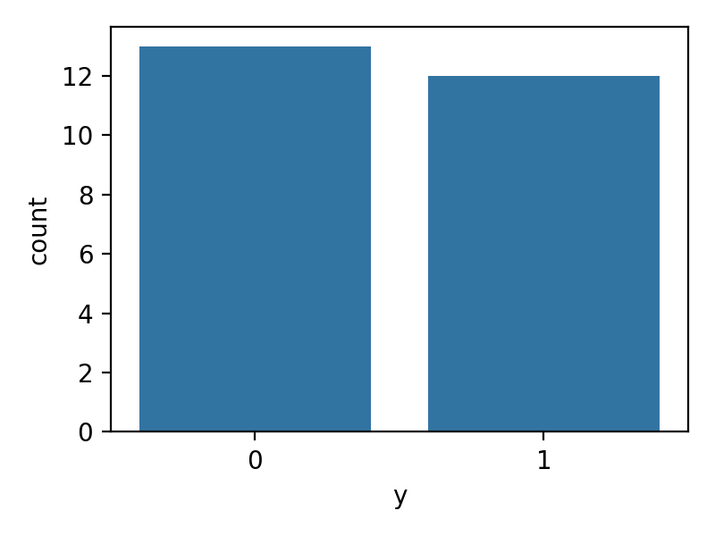
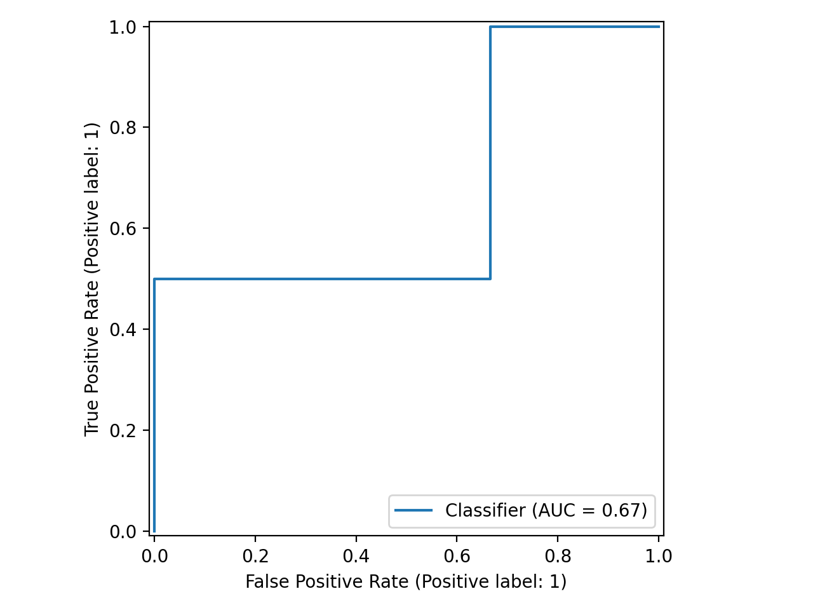
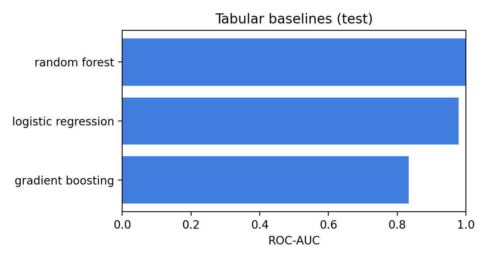
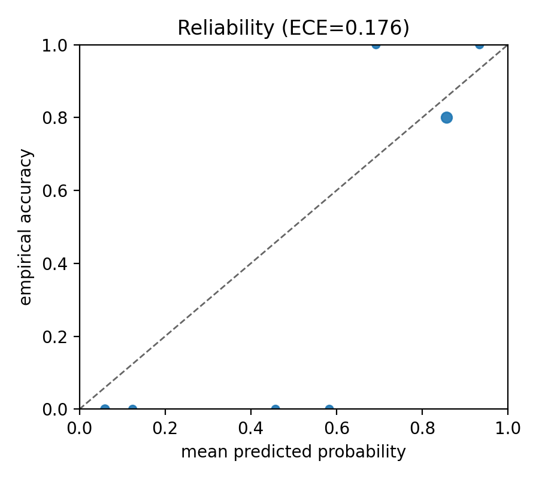

# OASIS-1 Dementia Benchmark: Leakage-Aware MRI + Clinical Baselines

This repository implements a **reproducible benchmark for dementia classification on OASIS-1**, using **subject-level (leakage-aware) splits**, **clinical/morphometric baselines**, and a **processed MRI baseline**.

**Goal:** evaluate whether image models actually add value over structured features under a *correct evaluation setup*.

> **Main claim:**
> Clinical + morphometric features provide a strong baseline signal; MRI models are only meaningful when evaluated directly against this baseline under leakage-aware subject splits.

---

# 🧠 Problem

Can dementia-related signal (`CDR > 0` vs `CDR = 0`) be predicted from structural MRI, and how does MRI modelling compare to tabular clinical/morphometric baselines when **data leakage is explicitly controlled**?

---

# 📊 Dataset

Current benchmark uses a **3-disc subset of OASIS-1** (`disc1–disc3`), with:

* **MR1 only** (one scan per subject)
* **subject-level splits**
* **rows with missing CDR removed**

Example snapshot (disc1 only, for illustration):

| Item              | Value |
| ----------------- | ----: |
| Sessions indexed  |    39 |
| Subjects (MR1)    |    39 |
| Labelled sessions |    25 |
| Dementia cases    |    12 |
| Non-dementia      |    13 |

<p align="center">
  
</p>

> Results below are from the **3-disc subset**, not the full dataset.

---

# 📈 Results (cross-validated classical baseline)

Subject-level cross-validation (3 discs):

| Model               | ROC-AUC (mean ± std) | AUC pooled 95% CrI | Bal Acc pooled 95% CrI | Brier |
| ------------------- | -------------------- | ------------------ | ---------------------- | ----- |
| Logistic Regression | **0.80 ± 0.14**      | 0.79 [0.68, 0.89]  | **0.71 [0.59, 0.80]**  | 0.186 |
| Random Forest       | 0.81 ± 0.12          | 0.79 [0.68, 0.88]  | 0.68 [0.56, 0.77]      | 0.183 |
| Gradient Boosting   | 0.78 ± 0.09          | 0.78 [0.67, 0.87]  | 0.67 [0.55, 0.77]      | 0.278 |

Bayesian intervals above are computed from pooled out-of-fold predictions:

* `logistic regression`: sensitivity `0.68 [0.50, 0.82]`, specificity `0.74 [0.59, 0.86]`
* `random forest`: sensitivity `0.71 [0.53, 0.84]`, specificity `0.64 [0.49, 0.78]`
* `gradient boosting`: sensitivity `0.61 [0.44, 0.77]`, specificity `0.72 [0.57, 0.84]`

Single-split snapshot (n=14 test subjects, for illustration only):

| Model               | Input      |       ROC-AUC | Balanced acc | Brier |   ECE |
| ------------------- | ---------- | ------------: | -----------: | ----: | ----: |
| Logistic regression | tabular    |         0.979 |        0.875 | 0.117 | 0.176 |
| Random forest       | tabular    |         1.000 |        0.750 | 0.125 | 0.291 |
| Gradient boosting   | tabular    |         0.833 |        0.812 | 0.199 | 0.208 |
| 2D CNN              | MRI        |           WIP |          WIP |     — |     — |
| Fusion              | multimodal |           WIP |          WIP |     — |     — |

Representative single-split plots from the latest tabular run:

<p align="center">
  
  
  
</p>

---

# 🔑 Key takeaway

> **Structured features already carry strong dementia signal.**

* Logistic regression is the most **reliable baseline**:

  * strong ROC-AUC
  * stable balanced accuracy
  * better calibration than tree models
  * strongest pooled Bayesian interval profile
* Random forest shows **perfect ranking on some splits**, but poorer calibration and threshold stability
* Errors concentrate on **older nondemented controls**, indicating:

  * the model learns age/atrophy signal
  * but struggles to separate ageing from pathology
* Dominant features are consistent across models:

  * `nWBV` is the strongest feature
  * `Educ` is the next strongest linear signal
  * `Age` is the clearest secondary tree-based driver

👉 MRI models must beat this baseline **under the same split** to be meaningful.

---

# ⚠️ Important note (small-data behaviour)

* Test sets are small → metrics are **high variance**
* Cross-validation reduces optimism (≈0.98 → ≈0.80 AUC)
* This benchmark is designed to expose **small-data pitfalls**, not hide them

---

# 🧪 MRI baseline (current status)

A 2D CNN on processed MRI shows:

* unstable ranking signal depending on configuration
* balanced accuracy near chance on current small-sample runs
* wide uncertainty intervals, so weak CNN gains should not be trusted without interval-aware reporting

Common failure mode:

* near-constant prediction probabilities (`p_std ≈ 0`)
* weak class separation despite non-random ranking

👉 Indicates:

* input design is critical (slice choice, orientation)
* naive 2D models are insufficient
* the image baseline should be treated as a weak reference, not a competitive model yet

CNN outputs now include:

* Bayesian-bootstrap `ROC-AUC` intervals
* credible intervals for `sensitivity`, `specificity`, and `balanced accuracy`

Current fixed small-model smoke run (`coronal3_tiny_mean`, 1 epoch):

* ROC-AUC `0.54 [0.21, 0.83]`
* balanced accuracy `0.50 [0.35, 0.61]`
* `p_std = 0.00030`, indicating near-constant predictions even in the recommended small-model setting

That smoke result is included to show uncertainty-aware reporting, not as a final MRI benchmark.

Recommended current MRI baseline entrypoint, run in a separate shell:

```bash
bash scripts/bench_cnn_best.sh
```

This runs the current fixed small-model candidate:

* coronal slices
* 2.5D (`ch=3`)
* `tiny` architecture
* mean slice pooling

---

# 🧠 Main contribution

* Leakage-aware pipeline:

  ```
  index → manifest → subject splits → baselines → error analysis
  ```
* Dataset-style workflow via **manifest CSV**
* Explicit comparison:

  * tabular vs MRI vs fusion
* Calibration + uncertainty analysis
* Focus on **reproducibility over raw performance**

---

# 🧭 Why this matters

Deep learning often appears strong on small medical datasets due to:

* leakage
* duplicated scans
* shortcut learning

This benchmark enforces:

* subject-level evaluation
* transparent cohort definition
* explicit baseline comparison

👉 making results **trustworthy and interpretable**

---

# 🗂️ Data layout

* `data/raw/oasis1/` → immutable downloads
* `data/oasis1/` → extracted discs + manifests
* `data/processed/oasis1/` → derived outputs
* `reports/` → metrics, plots, analysis

---

# ⚙️ Quick start

```bash
uv sync
uv pip install -e .
```

---

# 🔁 Pipeline

## 1. Prepare dataset

```bash
bash scripts/prep_oasis1.sh
```

## 2. Tabular benchmark

```bash
bash scripts/bench_tab.sh
```

## 3. MRI baseline

```bash
uv run obench cnn2d ...
```
