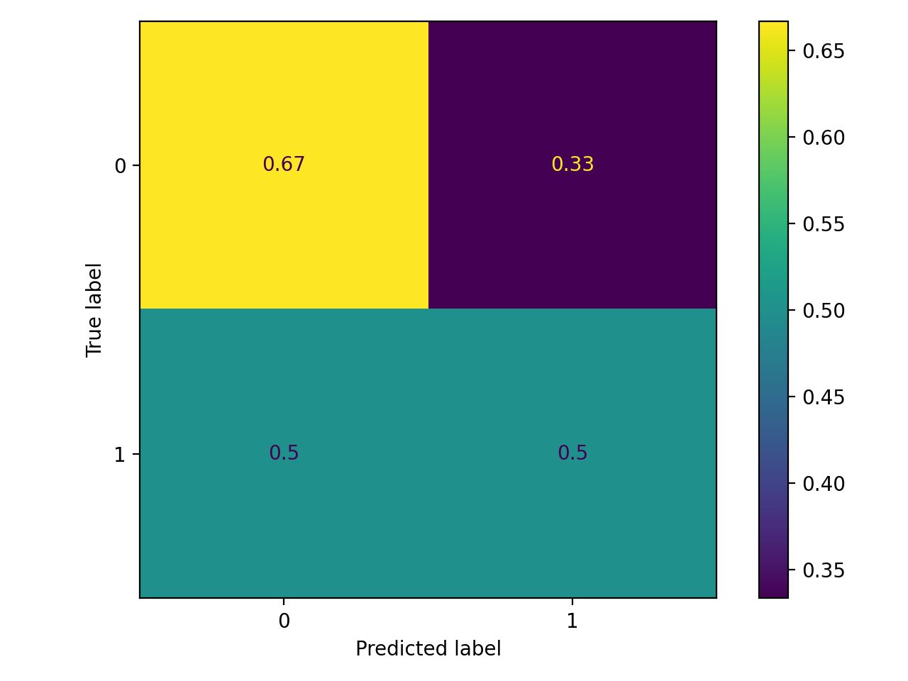

# OASIS-1 Dementia Benchmark

Small MRI datasets are where it’s easiest to fool yourself: leakage, duplicated scans, label sparsity, and “too-smart” clinical proxies can all inflate results. This repo is a deliberately simple, leakage-aware benchmark for dementia classification on OASIS-1 that makes the comparison explicit: **classical clinical/morphometric baselines vs modelling signal from processed structural MRI**.

## Question

Can subject-level dementia-related signal in OASIS-1 be predicted reliably from processed structural MRI, and how does raw image modelling compare against simple clinical and morphometric baselines?

## Pipeline (high level)


## Baseline results (example run; `disc1`, MR1-only, labelled rows only)

These numbers are from one small run (seed 7) and will change with discs, splits, and training settings.

| Model | Inputs | Leakage-aware split | ROC-AUC | Balanced acc |
|---|---|---:|---:|---:|
| Logistic regression | age/sex/hand + Educ/SES + eTIV/nWBV/ASF | yes | 0.667 | 0.583 |
| 2D CNN | processed MRI (`T88_111/*_t88_masked_gfc`) | yes | 0.167 | 0.500 |

Tabular ROC / confusion matrix:




## Main findings (current state)

- A tabular baseline using demographics + morphometrics provides a strong non-image reference point.
- A processed-MRI 2D CNN baseline is implemented as an image baseline (and currently underperforms on this tiny `disc1` subset).
- Splits are subject-level and MR1-only by default to reduce leakage from repeated acquisitions.
- Indexing scales from a single disc to multiple discs, producing a de-duplicated session manifest.

## Why this matters

If deep learning “beats” a classical baseline on small cohorts only under a leaky split or with heavy label/feature shortcuts, that’s not progress. A clean benchmark that surfaces cohort size, missingness, split rules, and failure cases is a better starting point for trustworthy biomedical imaging research.

## Data layout

- `data/raw/oasis1/`: downloaded archives + spreadsheets (immutable)
- `data/interim/oasis1/`: extracted archives + index files (derived)
- `data/processed/oasis1/`: optional preprocessed outputs (derived)
- `reports/`: plots, tables, error analysis

## First-class artefacts

- `data/interim/oasis1/index.csv`: file manifest created by `obench index` (paths + canonical processed volumes)
- `data/interim/oasis1/manifest.csv`: merged manifest (index + labels + key columns) created by `obench manifest`
- `splits/oasis1/*.txt`: subject-level split files created by `obench split`

## Setup (uv)

```bash
uv sync
```

## 1) Index extracted sessions

Extract one or more discs (example for disc1):

```bash
mkdir -p data/interim/oasis1
tar -xzf data/raw/oasis1/oasis_cross-sectional_disc1.tar.gz -C data/interim/oasis1
```

Build an index:

```bash
uv run obench index --root data/interim/oasis1/disc1 --out data/interim/oasis1/index.csv
```

Multiple discs (repeat `--root`):

```bash
uv run obench index --root data/interim/oasis1/disc1 --root data/interim/oasis1/disc2 --root data/interim/oasis1/disc12 --out data/interim/oasis1/index.csv
```

Or pass the parent folder (auto-detects `disc*` subfolders):

```bash
uv run obench index --root data/interim/oasis1 --out data/interim/oasis1/index.csv
```

The index stores per-session paths to `RAW/`, `PROCESSED/`, `FSL_SEG/`, `*.xml`, `*.txt`, and the canonical processed images.

## 1.5) Build a merged manifest (index + labels)

This produces a single CSV you can treat like a benchmark dataset table (labels + paths).

```bash
uv run obench manifest --index data/interim/oasis1/index.csv --sheet data/raw/oasis1/oasis_cross-sectional-5708aa0a98d82080.xlsx --out data/interim/oasis1/manifest.csv
```

## 2) Create subject-level splits

Default: use `MR1` only (one session per subject), and stratify by dementia label.

```bash
uv run obench split --index data/interim/oasis1/index.csv --sheet data/raw/oasis1/oasis_cross-sectional-5708aa0a98d82080.xlsx --out splits/oasis1
```

Outputs:

- `splits/oasis1/train.txt`
- `splits/oasis1/val.txt`
- `splits/oasis1/test.txt`

Each file contains one session `ID` per line (e.g. `OAS1_0018_MR1`).

## 3) Tabular baselines (clinical + morphometric)

Runs a regularized logistic regression with a simple, explicit feature set.

```bash
uv run obench tab --index data/interim/oasis1/index.csv --sheet data/raw/oasis1/oasis_cross-sectional-5708aa0a98d82080.xlsx --splits splits/oasis1 --out reports/tab
```

Outputs metrics + ROC/confusion matrix plots, and a CSV of per-subject errors.

## 3.25) Tabular error analysis

```bash
uv run obench errtab --errors reports/tab/run/errors.csv --out docs/err/tab
```

Example outputs committed: `docs/err/tab/README.md`, `docs/err/tab/age_by_tag.png`, `docs/err/tab/mmse_by_tag.png`.

## 3.5) EDA (quick sanity checks)

```bash
uv run obench eda --index data/interim/oasis1/index.csv --sheet data/raw/oasis1/oasis_cross-sectional-5708aa0a98d82080.xlsx --out reports/eda
```

This writes label counts (for labelled rows), missingness summary, and a few basic plots.

## 4) 2D MRI baseline (from processed MRI)

Trains a small 2D CNN on slices from the canonical processed volume (`T88_111/*_t88_masked_gfc`).

Run this in a separate shell:

```bash
uv run obench cnn2d --index data/interim/oasis1/index.csv --sheet data/raw/oasis1/oasis_cross-sectional-5708aa0a98d82080.xlsx --splits splits/oasis1 --out reports/cnn2d
```

## Notes on labels

By default:

- target is dementia: `CDR == 0` vs `CDR > 0`
- `CDR` is used only as a label (never as an input feature)
- rows with missing `CDR` are excluded from split/train/eval

If you decide to include cognitive tests (e.g. `MMSE`) as inputs, treat that as a separate “clinical realism” track.
