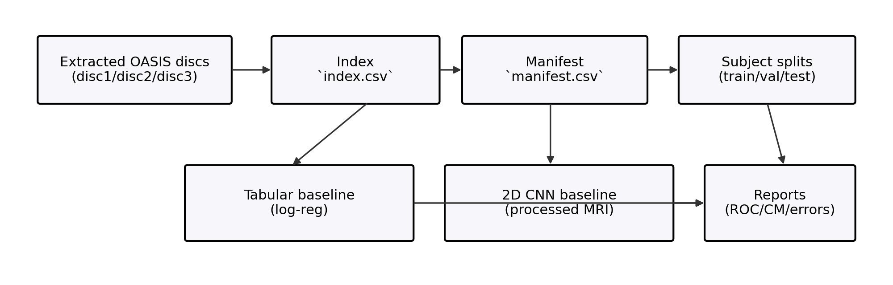

# OASIS-1 Dementia Benchmark: Leakage-Aware MRI + Clinical Baselines

This repository implements a reproducible benchmark for dementia classification on **OASIS-1** using **subject-level (leakage-aware) splits**, simple **clinical/morphometric** baselines, and a **processed structural MRI** baseline. The goal is to answer one practical question under a setup that resists “small data” pitfalls: do image models actually beat structured features, or do they only look better under leaky evaluation?

Main claim: **tabular clinical + morphometric features provide a strong baseline signal; MRI models are only meaningful when evaluated directly against this baseline under leakage-aware subject splits.**

## Problem

Can dementia-related signal in OASIS-1 (label: `CDR>0` vs `CDR=0`) be predicted reliably from processed T1 MRI, and how does MRI modelling compare to tabular clinical/morphometric baselines under subject-level splits?

## Dataset (example: `disc1`, MR1-only)

| Item | Value |
|---|---:|
| Sessions indexed | 39 |
| Subjects (MR1) | 39 |
| Labelled sessions (`CDR` present) | 25 |
| Dementia cases (`CDR>0`) | 12 |
| Non-dementia (`CDR=0`) | 13 |


## Results (example run; `disc1`, seed 7; labelled rows only)

Note: for `disc1` only, the test set is tiny (`n=5` labelled subjects in this split), so these numbers are high-variance and intended mainly to demonstrate the benchmark workflow.

| Model | Input | ROC-AUC | Balanced acc | Brier | ECE |
|---|---|---:|---:|---:|---:|
| Logistic regression | tabular | 0.667 | 0.583 | 0.225 | 0.263 |
| Random forest | tabular | 0.667 | 0.583 | 0.253 | 0.437 |
| Gradient boosting | tabular | 0.583 | 0.750 | 0.200 | 0.200 |
| 2D CNN | MRI | 0.167 | 0.500 | 0.247 | 0.084 |
| Fusion (log-reg) | tabular + MRI embedding | 0.667 | 0.583 | — | — |


Tabular model comparison (ROC-AUC):


Calibration (tabular baseline):


## One takeaway

On very small OASIS-1 subsets, **clinical + morphometric features provide a strong baseline** and should be treated as the reference point before claiming gains from image models. This repo is built to scale from `disc1` to all discs to make that comparison stable and defensible.

Conclusion (current snapshot): on `disc1`, the image baseline and fusion do not yet beat tabular; scaling to all discs is the next step before drawing strong conclusions.

## Main contribution

- A leakage-aware, benchmark-style pipeline (index → manifest → subject splits → baselines → error analysis).
- A first-class manifest (`index.csv`/`manifest.csv`) so experiments are “dataset-like”, not script-like.
- Baselines that make the comparison explicit: tabular (structured) vs image (processed MRI).
- A simple multimodal fusion baseline (tabular + image embedding) to test whether MRI adds value beyond structured features.
- Calibration + uncertainty plots (reliability diagram, confidence, entropy) to support “trustworthy AI” analysis.

## Pipeline (high level)



## Why this matters

If deep learning “wins” on small cohorts only under leaky splits, duplicated scans, or hidden shortcuts, it’s not a trustworthy result. A benchmark that surfaces split rules, cohort size/missingness, and failure cases is a better starting point for biomedical imaging research.

## Data layout

- `data/raw/oasis1/`: downloaded archives + spreadsheets (immutable)
- `data/interim/oasis1/`: extracted archives + index files (derived)
- `data/processed/oasis1/`: optional preprocessed outputs (derived)
- `reports/`: plots, tables, error analysis

## First-class artefacts

- `data/interim/oasis1/index.csv`: file manifest created by `obench index` (paths + canonical processed volumes)
- `data/interim/oasis1/manifest.csv`: merged manifest (index + labels + key columns) created by `obench manifest`
- `splits/oasis1/*.txt`: subject-level split files created by `obench split`

## Setup (uv)

```bash
uv sync
```

## Install (editable)

From the repo root:

```bash
uv pip install -e .
```

Dev tools (tests):

```bash
uv pip install -e ".[dev]"
uv run pytest
```

## 1) Index extracted sessions

Extract one or more discs (example for disc1):

```bash
mkdir -p data/interim/oasis1
tar -xzf data/raw/oasis1/oasis_cross-sectional_disc1.tar.gz -C data/interim/oasis1
```

Build an index:

```bash
uv run obench index --root data/interim/oasis1/disc1 --out data/interim/oasis1/index.csv
```

Multiple discs (repeat `--root`):

```bash
uv run obench index --root data/interim/oasis1/disc1 --root data/interim/oasis1/disc2 --root data/interim/oasis1/disc12 --out data/interim/oasis1/index.csv
```

Or pass the parent folder (auto-detects `disc*` subfolders):

```bash
uv run obench index --root data/interim/oasis1 --out data/interim/oasis1/index.csv
```

The index stores per-session paths to `RAW/`, `PROCESSED/`, `FSL_SEG/`, `*.xml`, `*.txt`, and the canonical processed images.

## 1.5) Build a merged manifest (index + labels)

This produces a single CSV you can treat like a benchmark dataset table (labels + paths).

```bash
uv run obench manifest --index data/interim/oasis1/index.csv --sheet data/raw/oasis1/oasis_cross-sectional-5708aa0a98d82080.xlsx --out data/interim/oasis1/manifest.csv
```

## 2) Create subject-level splits

Default: use `MR1` only (one session per subject), and stratify by dementia label.

```bash
uv run obench split --index data/interim/oasis1/index.csv --sheet data/raw/oasis1/oasis_cross-sectional-5708aa0a98d82080.xlsx --out splits/oasis1
```

Outputs:

- `splits/oasis1/train.txt`
- `splits/oasis1/val.txt`
- `splits/oasis1/test.txt`

Each file contains one session `ID` per line (e.g. `OAS1_0018_MR1`).

## 3) Tabular baselines (clinical + morphometric)

Runs a regularized logistic regression with a simple, explicit feature set.

```bash
uv run obench tab --index data/interim/oasis1/index.csv --sheet data/raw/oasis1/oasis_cross-sectional-5708aa0a98d82080.xlsx --splits splits/oasis1 --out reports/tab
```

Outputs metrics + ROC/confusion matrix plots, and a CSV of per-subject errors.

## 3.25) Tabular error analysis

```bash
uv run obench errtab --errors reports/tab/run/errors.csv --out docs/err/tab
```

Example outputs committed: `docs/err/tab/README.md`, `docs/err/tab/age_by_tag.png`, `docs/err/tab/mmse_by_tag.png`.

## 3.5) EDA (quick sanity checks)

```bash
uv run obench eda --index data/interim/oasis1/index.csv --sheet data/raw/oasis1/oasis_cross-sectional-5708aa0a98d82080.xlsx --out reports/eda
```

This writes label counts (for labelled rows), missingness summary, and a few basic plots.

## 4) 2D MRI baseline (from processed MRI)

Trains a small 2D CNN on slices from the canonical processed volume (`T88_111/*_t88_masked_gfc`).

```bash
uv run obench cnn2d --index data/interim/oasis1/index.csv --sheet data/raw/oasis1/oasis_cross-sectional-5708aa0a98d82080.xlsx --splits splits/oasis1 --out reports/cnn2d
```

## 4.5) Calibration / uncertainty (simple)

Tabular model calibration from `errors.csv`:

```bash
uv run obench cal --pred reports/tab/run/errors.csv --sheet data/raw/oasis1/oasis_cross-sectional-5708aa0a98d82080.xlsx --out reports/cal/tab
```

CNN calibration from `pred.json`:

```bash
uv run obench cal --pred reports/cnn2d/run/pred.json --sheet data/raw/oasis1/oasis_cross-sectional-5708aa0a98d82080.xlsx --out reports/cal/cnn2d
```

Example plots committed:


## 5) Fusion baseline (tabular + CNN embedding)

1) Train the 2D CNN to produce `reports/cnn2d/run/model.pt`.

2) Extract per-subject embeddings:

```bash
uv run obench emb2d --index data/interim/oasis1/index.csv --sheet data/raw/oasis1/oasis_cross-sectional-5708aa0a98d82080.xlsx --splits splits/oasis1 --weights reports/cnn2d/run/model.pt --out reports/emb/emb2d.csv
```

3) Train fusion:

```bash
uv run obench fuse --index data/interim/oasis1/index.csv --sheet data/raw/oasis1/oasis_cross-sectional-5708aa0a98d82080.xlsx --emb reports/emb/emb2d.csv --splits splits/oasis1 --out reports/fuse --model logreg
```

## Notes on labels

By default:

- target is dementia: `CDR == 0` vs `CDR > 0`
- `CDR` is used only as a label (never as an input feature)
- rows with missing `CDR` are excluded from split/train/eval

If you decide to include cognitive tests (e.g. `MMSE`) as inputs, treat that as a separate “clinical realism” track.
